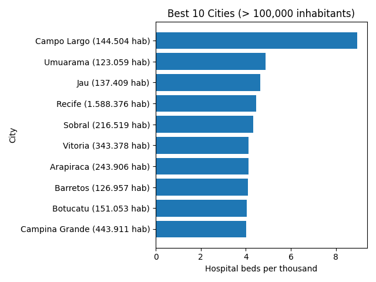

# 🇧🇷 Brazil Healthcare Capacity Analytics Engine


A modular **data analytics pipeline + CLI tool** that transforms Brazilian public healthcare data into actionable insights on **hospital bed availability per 1,000 inhabitants in the SUS healthcare system**.

---

## 🚀 Project Highlights

* 📊 End-to-end **data pipeline** (raw → insights)
* 🧠 **Hospital beds per 1,000 people (SUS) analytics**
* 🖥️ Fully **CLI-driven (argparse)**
* 📈 Clean and consistent **visualizations**
* 📤 Export to **CSV & Excel (multi-sheet reports)**
* ⚙️ Built with **real-world messy public data**

---

## 📸 Example Output

### 📊 Best Large Cities (Hospital beds per 1,000 people)

```
Campo Largo 
...
```


---

## ⚙️ CLI Usage

### ▶️ Run everything (default)

```bash
python src/main.py
```

---

### 📄 CSV Reports

```bash
python src/main.py csv --type bed
python src/main.py csv --type all --top_n 20
```

---

### 📊 Plots

```bash
python src/main.py plot --type best
python src/main.py plot --type worst --min_population 250000 --top_n 20
```

---

### 📑 Excel Report

```bash
python src/main.py excel
```

---

### ❓ Help

```bash
python src/main.py --help
```

---

## 🧠 Key Metric

**Hospital Beds per 1,000 People (SUS)**

```
BEDS_PER_1000 = (Total SUS Hospital Beds / Population) * 1000
```

✔ Enables fair comparison between cities of different sizes
✔ Standard public health indicator used internationally

---

## 🏗️ Architecture

```
Raw CSVs
   ↓
Data Loading
   ↓
Validation
   ↓
Cleaning & Normalization
   ↓
Merge (Hospital + Population)
   ↓
Aggregation (City Level)
   ↓
Feature Engineering
   ↓
Filtering (Population Threshold)
   ↓
Ranking (Best / Worst)
   ↓
Outputs (CSV / Excel / Plots)
```

---

## 📁 Project Structure

```
src/
  ├── main.py              # CLI (argparse)
  ├── analyzer.py         # Metrics
  ├── data_loader.py      # Load + validate
  ├── cleaner.py          # Cleaning logic
  ├── visualization.py    # Plots + exports

data/
  ├── Leitos_2026.csv
  ├── POP2025_20251031(Municípios).csv

outputs/
  ├── csv/
  ├── excel/
  ├── plots/
```

---

## 🧪 Data Sources

### 🏥 Hospital Infrastructure

* Dataset: *"Leitos 2026"*
* Source: https://dados.gov.br/dados/conjuntos-dados/hospitais-e-leitos
* Contains:

  * Hospital information
  * Available beds (general, ICU adult, pediatric, neonatal)
  * Focus on **SUS-regulated beds**

---

### 👥 Population Data

* Dataset: *"POP2025"*
* Source: https://ftp.ibge.gov.br/Estimativas_de_Populacao/Estimativas_2025/
* Contains:

  * Estimated population per municipality

---

## ⚠️ Real-World Challenges Solved

* Inconsistent city names (accents, casing)
* Mixed encodings (`latin-1` vs UTF-8)
* Brazilian number formats (`1.234.567`)
* Missing and invalid data
* Dataset merge inconsistencies
* Division edge cases (e.g., zero population)

---

## 📈 Visualization Principles

* Horizontal bar charts → better ranking readability
* Labels include population → adds context
* Strict sorting by beds per 1,000 people → avoids bias
* No secondary sorting → preserves analytical integrity

---

## 🛠️ Tech Stack

* Python
* pandas
* matplotlib
* openpyxl
* argparse

---

## 🎯 Why This Project Stands Out

This project demonstrates:

* ✅ Data Engineering pipeline design
* ✅ Real-world data cleaning
* ✅ CLI-based analytics tooling
* ✅ Public health metric standardization
* ✅ Clear data storytelling

---

## 🚀 Future Improvements

* Add IBGE municipality codes (stronger joins)
* Geospatial visualization (maps)
* Interactive dashboard (Streamlit)
* Time-series healthcare analysis
* Package as installable CLI tool

---

## 📌 Author

Portfolio project focused on **Data Analytics & Data Engineering**, with emphasis on:

* Real-world datasets
* Scalable design
* Insight generation

---

## ⭐ If you found this useful

Give the repo a star — it helps a lot!
